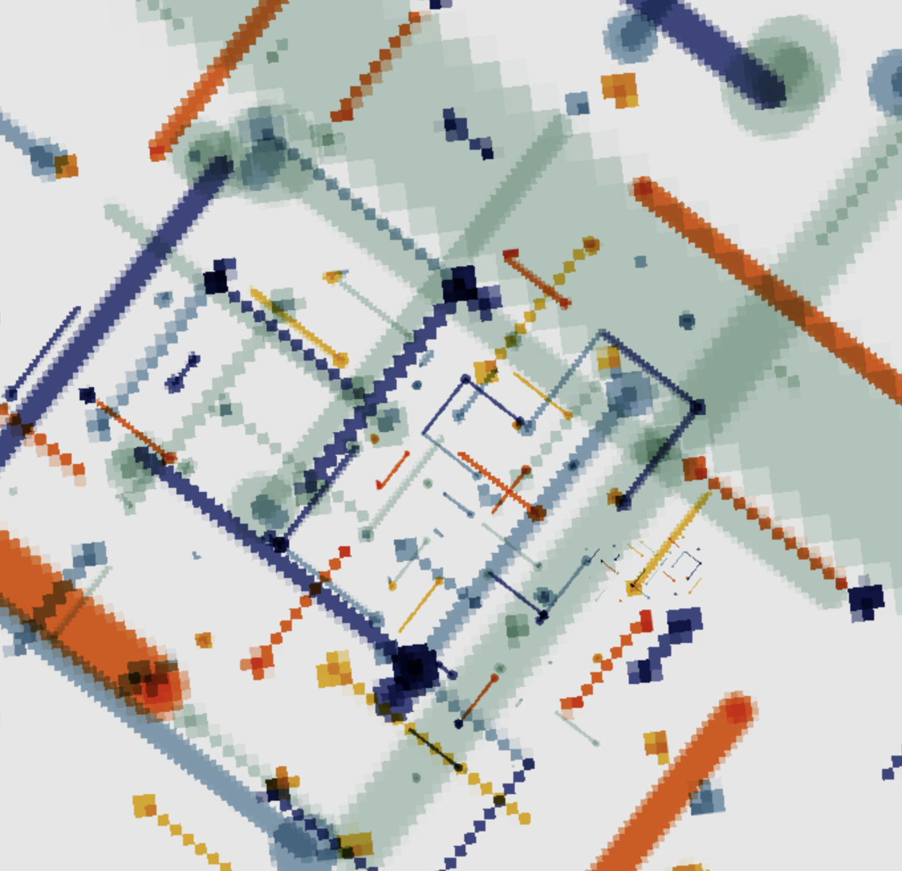
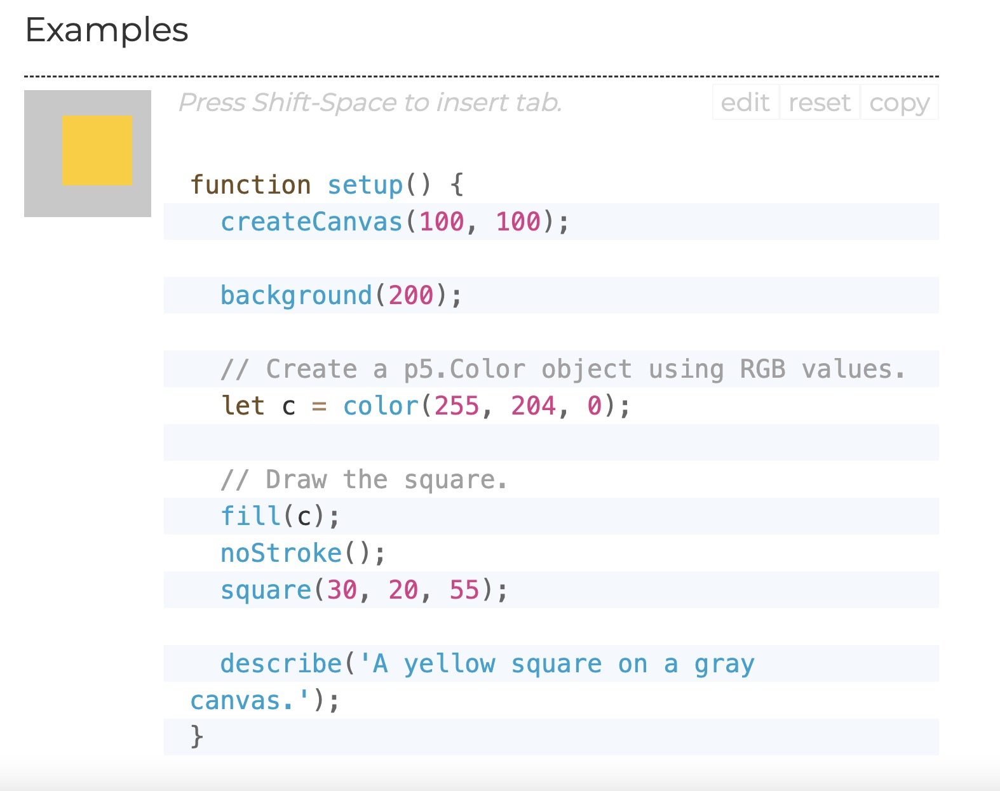

# QUIZ8

### Part 1: Imaging Technique Inspiration
<!-- #### Header 4
##### Header 5
###### Header 6
**Bold Text** or __Bold Text__
*Italic Text* or _Italic Text_ -->
- Our group selection is Piet Mondrian's Broadway Boogie Woogie by Piet Mondrian is one of his famous works. The painting was created during his time in New York and reflects his unique perspective on city life and modernist art.

 
 

-The image consists of a series of coloured squares that give me the impression of city streets and traffic. That is why I chose images 1 and 2. I hope that I can apply the colour shifts and graphic scaling in the images to our project.

 
 
 
 

### Part 2: Coding Technique Exploration

- Use color () to fill in the square color
 
 

2. Second Item
3. Third Item
[Link Text](https://www.google.com
Links to an external site.)
